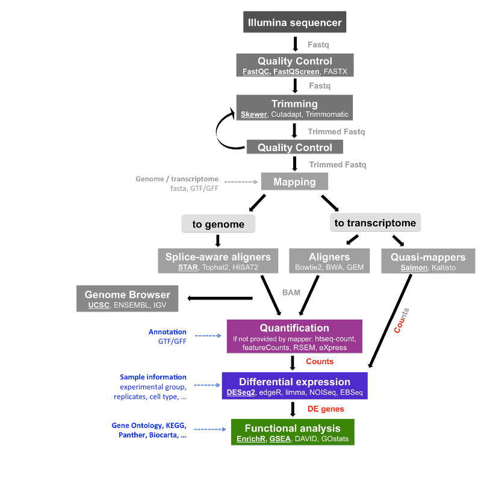

## Tutorial for Differential Expression analysis

Hello everyone! 

Welcome to this GitHub repository. This repository was designed to provide you a wide view for the Differential Expression (DE) analysis using the bioconductor package **[DESeq2](http://bioconductor.org/packages/release/bioc/html/DESeq2.html)**. It is based on the pipeline published by [Michael Love](https://bioconductor.org/packages/release/workflows/vignettes/rnaseqGene/inst/doc/rnaseqGene.html).
Please, be aware that this tutorial is split in two pipelines:


**Long**


**Short**




## Required packages


Before running the analysis, please install the following R packages from CRAN:

* tidyverse
* RColorBrewer
* pheatmap
* here


Also, make sure that you have installed the latest version of BioConductor. If not, run the next lines on R:

```
if (!requireNamespace("BiocManager", quietly = TRUE))
    install.packages("BiocManager")
BiocManager::install(version = "3.13")
```
and install:

* tximeta
* DESeq2
* PCAtools
* apeglm
* Glimma
* clusterProfiler
* enrichplot
* biomaRt
* fgsea

## Folder content

This is the distribution of folders and files in this repository:

```
+-- Tutorial for Differential Expression analysis
|		+--bin/
|		+--data/
|		+--Output/
|		+--slides/
|		+--reference/
```
### `bin/`
This folder stores the required scripts to run the DE analysis in R:

`1.QC_analysis.sh`. Script to perform quality control of raw reads using **FastQC** and **MultiQC**.

`2.Read_cleaning.sh`. Script for clean the reads and remove the Iluminna universal adapter sequence from raw reads using **Cutadapt**.

`3.Pseudoalignment.sh`. This script contains the code for performing pseudoalignment and abundance estimation using **Salmon**

`4.Differential_expression_analysis.R`. This script performs differential expression testing using the algorithm of **DESeq2**.

`functions.R`. Script containing useful functions.

### `data`
Folder for storing the raw counts in `fastq.gz` format. After getting the raw counts, please copy them in this folder. Also, copy the [SummarizedExperimentObj.rdata](https://drive.google.com/file/d/1E7s8yCO4Gb4FFoEfLMXz0dsZNufn0X2-/view?usp=sharing) in this folder if you decide to follow the shortest pipeline.


### `Rmd` and `html`
These folders contains the Rmd and html files for the slides and the cheatsheet. Follow this [link](https://necrosnake91.github.io/Tutorial_of_RNA_seq/html/Slides.html#1) to visualize the Slides. The cheatsheet is ubicated [here](https://necrosnake91.github.io/Tutorial_of_RNA_seq/html/Differential_expression_analysis_tutorial.html).

If you decide to follow the shortest pipeline, this link redirects you to the [slides](https://necrosnake91.github.io/Tutorial_of_RNA_seq/html/Slides_short.html#1) or the [cheatsheet](https://necrosnake91.github.io/Tutorial_of_RNA_seq/html/Expresion_diferencial.html) 

### `Results`
This folder stores the results derived from:

* FastQC
* MultiQC
* Salmon_quants

### `reference`
The reference transcriptome downloaded from the [GENECODE](https://www.gencodegenes.org/human/) site is stored here in `fasta` format.

I suggest you take a read to the user's manual for each package in order to find useful information to perform DE analysis on your data. 