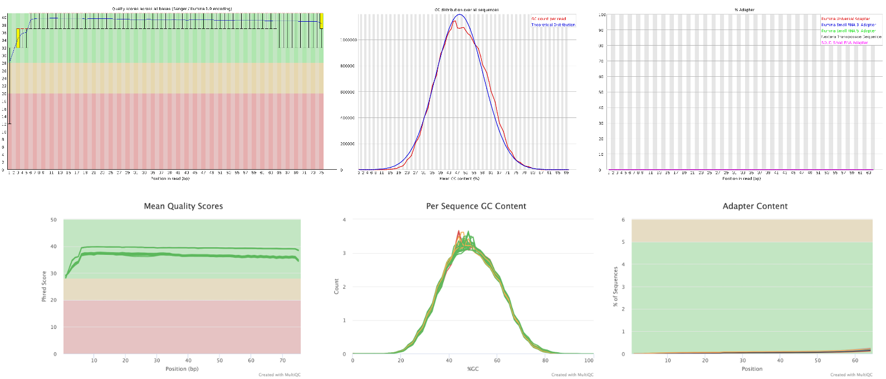

```{r, echo = F, include = FALSE}
library(tidyverse)
library(tximeta)
library(here)
library(DESeq2)
library(apeglm)
library(PCAtools)
library(Glimma)
library(RColorBrewer)
library(pheatmap)
library(clusterProfiler)
library(biomaRt)
library(enrichplot)
library(fgsea)
source("../bin/functions.R")
```

```{r setup, include=FALSE}
knitr::opts_chunk$set(echo = TRUE)

# all your necessary packages
packages <- c("tidyverse", 
             "knitr",     
             "bibtex"
             # add your other packages here     
             )  

# install if needed and loading packages
to_install <- packages[! packages %in% installed.packages()[, "Package"]]
if (length(to_install)) { 
  install.packages(to_install, repos = "https://cloud.r-project.org")
}
invisible(lapply(packages, library, character.only = TRUE))

# get the packages version 
packages_versions <- function(p) {
  paste(packageDescription(p)$Package, packageDescription(p)$Version, sep = " ")
}

# Get the packages references
write.bib(packages, "packages.bib")

# merge the zotero references and the packages references
cat(paste("% Automatically generated", Sys.time()), "\n% DO NOT EDIT",
    { readLines("biblio.bib") %>% 
      paste(collapse = "\n") },
    { readLines("packages.bib") %>% 
      paste(collapse = "\n") },
    file = "biblio.bib",
    sep = "\n")

# Some packages reference keys must be modified
# (their key is not the package name)
# check in packages.bib
packages_keys <- packages %>% 
  enframe() %>% 
  mutate(value = case_when(value == "knitr" ~ "@knitr1",
                           #value == "boot" ~ "@boot1",
                           TRUE ~ paste0("@", value)))
```


# I. Objetivos

- Conocer el flujo de trabajo empleado en el análisis bioinformático de datos obtenidos por *RNA-seq*
- Explicar el análisis de expresión diferencial empleando DESeq2
- Analizar un conjunto de datos de expresión empleando un script de DESEq2

# II. Requisitos

Esta práctica está basada en el flujo de trabajo o *pipeline* de [Michael Love](https://bioconductor.org/packages/release/workflows/vignettes/rnaseqGene/inst/doc/rnaseqGene.html) por lo que requerirémos de:

## Datos

Los datos fueron descargados de un proyecto público titulado **NRF2 signalling associated with radioresistance in colorectal cancer models** de la base de datos [GEO](https://www.ncbi.nlm.nih.gov/geo/query/acc.cgi?acc=GSE136011). El número de acceso del trabajo es **GSE136011**. Los datos que requeriremos para la práctico serán:

- En formato **FastQ** para iniciar la prácitca desde el inicio

- Las cuentas crudas generadas por *Salmon* ubicadas en este [vínculo]()

- Los objetos de R para iniciar el análisis de expresión diferencial. Se ubican en el siguiente [vínculo]()

## Programas
### `r icons::fontawesome("linux")` Shell

Descarga e instala los programas empleando el gestor de paquetes de python **[Conda](https://conda.io/projects/conda/en/latest/user-guide/install/index.html)**. Sigue las instrucciones específicas para tu sistema operativo desde la opción *Regular installation*.
Una vez que hayas descargado e instalado correctamente conda, prueba el siguiente comando:

```{bash, echo = T, eval = F}
conda list
```

Instala los siguientes programas:

- FastQC
- MultiQC
- Cutadapt
- Salmon

Corriendo el comando:

```{bash, echo = T, eval = F}
conda install -c  bioconda <paquete>
```

### `r icons::icon_style(icons::fontawesome("r-project"), fill = "#1A44A4")` R

Los paquetes de R que vas a emplear en la práctica se descargarán desde los repositiorios de **[Bioconductor]()** y **CRAN**. Para ello asegurate que tienes instalada la **última versión** de **[R](https://cran.itam.mx/)** y la IDE de **[RStudio](https://www.rstudio.com/products/rstudio/download/)**. 
Una vez configurado correctamente R, procede a instalar la **última versión** de Bioconductor corriendo el siguiente comando:

```{r, echo=T, eval=F}
install.packages("BiocManager")
BiocManager::install(version = 3.13)
```

Instalado Bioconductor, descarga e instala los siguientes paquetes:

- tximeta
- DESeq2
- PCAtools
- apeglm
- Glimma
- clusterProfiler
- enrichplot
- biomaRt
- fgsea

Corriendo el siguiente comando:
```{r,  echo=TRUE, eval=F}
BiocManager::install("paquete")
```

Los paquetes que descargaremos desde CRAN son:

- tidyverse
- RColorBrewer
- pheatmap
- here

Corriendo el comando:

```{r, echo=T,  eval=F}
install.packages("paquete")
```


# III. Análisis bioinformático de los datos de secuenciación

Para el análisis bioinformático vamos a seguir este *pipeline*:


1. Control de calidad de las secuencias crudas
2. Filtrado y limpieza de las secuencias
En los siguientes vínculos encontrarán los manuales de [Trimmomatic](http://www.usadellab.org/cms/uploads/supplementary/Trimmomatic/TrimmomaticManual_V0.32.pdf) y [Cutadapt](https://cutadapt.readthedocs.io/en/stable/guide.html).
3. Alineamineto
Para una revisión detallada del algoritmo de **Salmon**, pueden revisar el [artículo](https://www.nature.com/articles/nmeth.4197) publicado por sus desarrolladores [@dobinSTARUltrafastUniversal2013]. Asimismo la versión más reciente del [manual](https://salmon.readthedocs.io/en/latest/salmon.html).

<div class="alert alert-warning">
Si decides realizar el ejercicio desde el inicio, empieza desde este punto. De lo contrario salta a la sección 4.2
<div/>

## 1. Control de calidad de las secuencias crudas

- Primer paso a realizar en los flujos de trabajo para el análisis de expresión diferencial. A este proceso también se le conoce como *Quality Control* o *QC analysis* 

- Permite verificar la calidad de las lecturas a distintos niveles:
  - Asignación de bases
  - Secuencias duplicadas
  - Presencia de contaminación específica o inespecífica
  
Pasos para correr **FastQC**

1. Abre una ventana de la terminal y ubicate en el directorio `bin/` del presente repositorio 

2. Activa tu ambiente de conda corriendo:
```{bash, echo = T, eval =F}
conda activate <ruta al directorio miniconda2 o minicoda3>
```

3. Comprueba que el programa FastQC se encuentra correctamente instalado:
```{bash, echo = T, eval =F}
fastqc -h
```

4. Analiza la calidad de las secuencias crudas:
```{bash, echo = T, eval = F}
fastqc ../data/*.fastq.gz -o ../Output/FastQC/
```

Para concatenar o juntar los resultados de todas las muestras analizadas por FastQC, usemos **MultiQC**

1. Corrobora que MultiQC se encuentra correctamente instalado:
```{bash, echo = T, eval = F}
multiqc -h
```

2. Ejecuta el programa para analizar los archivos con terminación `.zip` generados por FastQC
```{bash, echo = T, eval = F}
multiqc ../Output/FastQC/*.zip -o ../Output/MultiQC/
```

Explora y revisa los archivos generados por FastQC y MultiQC


<div class="alert alert-warning">

Importante revisar si los problemas detectados por FastQC en la calidad de las secuencias se presentan en una, varias o todas las muestras porque de esto dependerán las correcciones a las lecturas crudas para mejorar su calidad.

</div>

## 2. Limpieza y corrección de la calidad de las lecturas

- Proceso que depende de los resultados del QC 
- Permite:
  - Filtrar las lecturas para seleccionar aquellas que tengan mayor calidad
  - Recortar lecturas para preservar los fragmentos de mayor calidad
  - Recortar lecturas para eliminar secuencias contaminantes (adaptadores)
  
Pasos para correr **Cutadapt**:

1. De manera similar al análisis anterior, asegura que te encuentras en
el directorio `bin/`, tienes activo el ambiente de conda y `cutadapt` se encuentra correctamente instalado:
```{bash, echo = T, eval = F}
cutadapt -h
```

2. Ejecuta `cutadapt` para una sola muestra:
```{bash, echo = T, eval = F}
cutadapt -a AATGATACGGCGACCACCGAGATCTACACTCTTTCCCTACACGACGCTCTTCCGATCT ##Para el read forward
-A AATGATACGGCGACCACCGAGATCTACACTCTTTCCCTACACGACGCTCTTCCGATCT ##Para el read reverse
-o ../Output/Cutadapt/samp1_clean_R1.fastq.gz ##Archivo de salida para las lecturas forward
-p ../Output/Cutadapt/samp1_clean_R2.fastq.gz ##Archivo de salida para las lecturas reverse
../data/samp1_R1.fastq.gz ##Ruta hacia las lecturas crudas forward
../data/samp1_R2.fastq.gz ##Ruta hacia las lecturas crudas reverse

```

Para ejecutar `cutadapt` en todas las muestras abre el archivo titulado `2.Read_cleaning` en el directorio `bin/` y encotrarás el código anidado en un bucle o *for loop*. 
Desde la terminal corre:
```{bash, echo = T, eval = F}
bash 2.Read_cleaning
```

<div class="alert alert-warning">

Al finalizar el filtrado y recorte o *triming* de la secuencias crudas, vuelve a analizar la calidad con `fastQC` y `MultiQC` de las lecturas limpias.

</div>

## 3. Alineamiento, mapeo y estimación de la abundancia de las lecturas

- Proceso necesario para conocer la región del genoma o transcriptoma a partir de la cual se generaron las lecturas
- Permita anotar las lecturas y categorizarlas como: mRNA, lncRNA, ncRNA, miRNA, ...
- Estimación del número de lecturas a nivel de gen, isoforma, exón, ...

<div class="alert alert-warning">

Aunque `Salmon` es un pseudoalineador y no requiere de  mayor uso de recursos computacionales comparado con `STAR`,  `HISAT2` o `Tophat2`, es recomendable que el proceso lo realices en un *cluster* para que lo paralelices.

</div>

Pasos para alinear con salmon:
1. Generar el índice del transcriptoma (humano) empleando el archivo fasta descargado desde la página de [GENECODE](https://www.gencodegenes.org/human/) (sección de *Fasta Files*).

2. Correr el siguiente código para generar el índice:
```{bash, echo = T, eval = F}
salmon index -t ../reference/Homo_sapiens.GRCh38.cdna.all.fa ##Ruta hacia el archivo fasta del transcriptoma de referencia
-i ../reference/hsa_v38_gencode ##Ruta para almacenar los archivos generados del índice
```

3. Una vez generado el índice, realizar el pseudoalineamiento para una muestra:
```{bash, echo = T, eval = F}
salmon quant -i ../reference/hsa_v38_gencode ##Ruta hacia el índice
-l A ##Opción para permitir a salmon deducir de forma automática las características de la libreria
-1 ../Output/Cutadapt/samp1_clean_R1.fastq.gz ##Ruta a las lecturas forward
-2 ../Output/Cutadapt/samp1_clean_R2.fastq.gz ##Ruta a las lecturas reverse
-p 8 ##Número de cores para paralelizar el proceso
--validateMappings -o ##Opción  para permitir a salmon validar los archivos bam generados de forma temporal
../Output/salmon_quants/samp1_quant ##Ruta para guardar las cuentas crudas generadas por salmon
```

Si deseas realizar este proceso para todas las muestras, corre el siguiente código:
```{bash,  echo = T, eval = F}
bash 3.Pseudoalignment
```

## 4. Análisis de  expresión diferencial

### 4.1 Importe de archivos a R

Al finalizar el proceso de estimación de la abundancia, Salmon nos devuelve los siguientes archivos por muestra:
```{bash, echo = T}
ls ../results/salmon_quants/
```


Se requieren importar los datos generados `quant.sf` de cada muestra a R. Para ello vamos a utilizar la librería [tximeta](https://bioconductor.org/packages/release/bioc/html/tximeta.html) [Cita]. Esta librería importa archivos de cuentas:

- Generadas por `salmon`
- Preserva metadatos asociados al proceso de pseudoalineamiento (versión del transcriptoma de referencia, código empleado, versión del pseudoalineador, ...)

Para importar los datos a R vamos a requerir de una tabla de metadatos en formato de texto plano

```{r, echo = T, eval = T}
list.files(here("results/salmon_quants/"))
```

1. Cargar a R la tabla de metadatos:
```{r, echo = T, eval = T}
coldata <- read.table(here("results/salmon_quants/metadata.txt"), he = T, stringsAsFactors = T, sep = "\t")

rownames(coldata) <- coldata$unique_id

head(coldata)
```

2. Crear una nueva columna a la tabla que incluya la ruta hacia los archivos de las cuentas crudas generados por `salmon`:
```{r, echo = T, eval = T}
coldata <- dplyr::mutate(coldata, files = file.path(here("results/salmon_quants"), paste0(coldata$key, "_quant"), "quant.sf"))
```

3. Verificar que las rutas hacia los archivos de las cuentas fue correctamente creada:
```{r, echo = T, eval =  T}
coldata <- mutate(coldata, file_exist = file.exists(coldata$files))

coldata[, 2:8]
```

4. `tximeta` requiere que exista una columna en la tabla de metadatos llamada **names** y que incluya el nombre de los directorios en donde se encuentra almacenadas las cuentas por cada muestra (samp1_quant)
```{r, echo = T, eval = T}
coldata <- mutate(coldata, names = paste0(coldata$key, "_quant"))
```

5. Si todas las rutas fueron creadas correctamente, importa los datos usando `tximeta`
```{r, echo = T, eval = T}
se <- tximeta(coldata)
```

<div class="alert alert-warning">

Ya que `tximeta` descarga información relacionada con el transcriptoma de referencia, este último paso requiere de una conexión estable a internet de alta velocidad por lo que puede llegar a tardar el proceso.

</div>

6. El objeto `se` tiene clase de *SummarizedExperiment* y las cuentas están reportadas a nivel de transcrito (isoforma). Para obtener las cuentas a nivel de gen:
```{r, echo = T, eval = T}
gse <- summarizeToGene(se)
```

Explora el objeto gse (*SummarizedExperiment*) 
```{r, echo = T, eval = F}
##Acceder a la  tabla de metadatos
colData(gse)

##Acceder al objeto GRanges con la información de los rangos y anotación de cada gen
head(rowRanges(gse))

##Acceder a la matriz de cuantas crudas
head(assay(gse))
```

### 4.2 Cargando los archivos desde el objeto .rdata

Si has decidido comenzar con el ejercicio desde este punto, solo necesitas cargar el objeto `SummarizedExperimentObj.rdata` ubicado en el folder llamado `data/`

```{r}
##Carga el archivo usando la función load
load("../data/SummarizedExperimentObj.rdata")
```

Verifica que en el ambiente de R se cargaron correctamente los siguientes objetos:

- dds
- gse
- se

### Exploración de los datos

Previamente al análisis de expresión diferencial, es necesario explorar los datos:

- Conocer la estructura del set de datos
- Detectar consistencia entre réplicas
- Visualizar comportamientos atípicos (*outliers*)
- Reportar las variables que separan o agrupan los datos

El **análisis de componentes principales** (PCA) nos permita reducir la dimensionalidad de nuestro set de datos y analizarlos de manera más intuitiva.

Los pasos para explorar el juego de datos son los siguientes:

1. Crear un objeto `DESeq` (*SummarizedExperiment*) a partir del objeto `gse`
```{r, echo = T, eval = T}
dds <- DESeqDataSet(se = gse, ##Objeto SummarizedExperiment que contiene la matriz de cuentas crudas
                    design = ~ Treatment) ##Variable con los grupos experimentales a contrastar. Forma parte de las columnas de coldata
```

2. Visualizar el grupo de referencia o **control** de la variable seleccionada
```{r, echo = T, eval = T}
##El primer nivel o elemento es el grupo control  ("CT")
levels(dds$Treatment)
```

3. Dependiendo de la pregunta a responder, recodifica el  grupo de referencia:
```{r, echo = T, eval = T}
dds$Treatment <- relevel(dds$Treatment, "siRNA_control")

levels(dds$Treatment)
```

4. Ya que los genes que muestran bajo número de cuentas (abundancia) no nos interesan en el análisis, selecciona aquellos que muestran mayor abundancia usando un punto de corte:
```{r, echo = T, eval = T}
##Recupera los genes que muestran más de 1 cuenta en al menos 3 muestras
keep <- rowSums(counts(dds) >= 1) >=3

##Visualiza cuántos genes pasaron el filtro de abundancia
table(keep)

##Corta los genes que pasaron el filtro de abundancia del objeto dds
dds <- dds[keep, ]
```

5. Para explorar los datos por medio del PCA necesitamos normalizar las cuentas crudas para que  los datos sean más comparables entre sí. Empleamos la transformación *regularized-logarithm transformation* recomendada para juegos de datos con una n < 30:
```{r, echo = T, eval = T}
rld <-  rlog(dds, blind = F)
```

6. Realiza el PCA empleando el paquete `PCAtools`:
```{r, echo = T, eval = T}
##Indicarle a  la función pca que los datos deben de ser escalados para que sean más comparables entre sí
pca <- pca(assay(rld), metadata = colData(rld), scale = T)

##Graficar el resultado del PCA mostrando las etiquetas de acuerdo al nombr + tratamiento + réplica y coloreando los puntos de acuerdo al tipo de tratamiento
biplot(pca, lab = rownames(colData(rld)), colby = "Treatment")
```

- ¿Cuál es la estructura del juego de datos?
- ¿Cuál fue la variable que causó dicho separamiento?
- ¿Existen datos *outlier*?
- ¿La consistencia entre las réplicas es adecuada?

Si deseas generar una gráfica interactiva de un análisis de reducción de dimensiones, utiliza la funcion `glimmaMDS()` del paquete `Glimma` la cual realiza un escalamiento multidimensional del set de datos.

### Análisis de expresión diferencial

El análisis de expresión diferencial en `DESeq2` se encuentra completamente automatizado. Al correr la función `DESeq()`, el programa:

- Emplea el método de las medianas de los ratios para calcular los factores de escalación (size-factors) y normalizar las cuentas crudas.
- Estima la dispersión de cada gen (réplicas biológicas cobran importancia)
- Ajusta  los datos a un modelo binomial negativo linearizado (GLM)
- Realiza la prueba de Wald para comparar los coeficientes asociados a cada gen (log2FC y padj)

El análisis de expresión diferencial en `DESeq2` se lleva a cabo de la siguiente forma:

1. Corre la función `DESeq()` para normalizar, estimar la dispersión y ajustar los datos al modelo binomial negativo.
```{r, echo = T, eval = T}
dds  <- DESeq(dds)
```

2. Realiza la prueba estadística para obtener los genes diferencialmente expresados:
```{r}
##Usemos la función results con los parámetros por default
res <- results(dds)

##Visualiza el objeto que contiene los resultados
res

##Obten el número de genes sobre- y sub-expresados de acuerdo a la prueba estadística
summary(res)
```

Aspectos importantes al correr la función `results()` con los parámetros por default:

- El contraste entre grupos experimentales de la variable tratamiento se realizó entre el factor re-codificado como control (siRNA_cotnrol) y el último factor de la variable (siRNA_NRF2), es decir, **siRNA_NRF2 vs siRNA_control**
- El punto de corte de expresión (log2FoldChange) fue de 0
- El punto de corte estadístico fue de padj < 0.1

...En otras palabras, estás recuperando genes que se expresan más de una o menos de una vez con respecto al control y aceptando 10 resultados falsos positivos por cada 100 pruebas...

¿Podemos modificar el contraste y los *threshold* de expresión y estadísticos?... **¡Sí!**

Para modificar las variables a contrastar:
```{r, echo = T, eval = T}
##Corre la función results names para conocer los contrastes disponibles
resultsNames(dds)

##Elige el contraste de tu preferencia y especificalo en el argumento contrast de la función  res
results(dds, contrast = c("Treatment", "mut_NRF2", "siRNA_control"))
```

Para modificar los *threshold* de expresión y estadístico:
```{r,  echo = T, eval = T}
##Emplea los argumentos lfcthreshold y alpha para especificar ambos puntos de corte de forma simultánea
res_LFC <- results(dds, lfcThreshold = 1, alpha = 0.05)

res_LFC

summary(res_LFC)
```

Lo anterior nos indica  que hay 15 genes que muestran expresión diferencial significativa (padj < 0.05) expresados 2 veces más o 0.5 veces menos respecto al control...

<div class="alert alert-warning">

Un procedimiento muy común es realizar la prueba estadística con un lfcthreshold = 0 y posterioremente obtener (subset) los genes que muestran un log2FoldChange > |1| y reportarlos como diferencialmente expresados. Este procedimiento es incorrecto, ya que se el valor de padj pierde todo su significado y corremos el riesgo de reportar resultados falsos positivos

```{r, echo = T, eval = F}
##Del objeto res (lfcthreshold = 0 y alpha = 0.1) filtra los genes que tienen un lfc > |1| y padj < 0.05
as.data.frame(results(dds, lfcThreshold = 0, alpha = 0.05)) %>% dplyr::filter(log2FoldChange > 1 & padj < 0.05 | log2FoldChange < -1 & padj < 0.05) %>%
  nrow()

##Compara los resultados con el objeto res_LFC
as.data.frame(res_LFC) %>% dplyr::filter(log2FoldChange > 1 & padj < 0.05 | log2FoldChange < -1 & padj < 0.05) %>%
  nrow()
```

<div/>


### Visualización de los resultados
#### MA-plot

Es una gráfica útil para visualizar la distribución de los genes que se encuentran diferencialmente expresados tomando en cuenta:

- log2FoldChange en el eje "Y" (M de minus o contraste)
- El promedio de las cuentas normalizadas de cada gen en todas las muestras analizadas en el eje "X" (A de average)

```{r, echo = T, eval = T}
##Corre la función plotMA sobre el objeto de los resultados
plotMA(res)
```

Nota: Existe una sobre-estimación del log2FoldChange para genes poco abundantes (media de cuentas normalizadas baja). Para corregir la sobre-estimación del log2FoldChange para dichos genes sin afectar los valores de aquellos con mayor abundancia usamos la función `lfcShrink()` de la librería `apeglm`

```{r, echo = T, eval = T}
res_shrink <- lfcShrink(dds = dds, res = res, coef = "Treatment_siRNA_NRF2_vs_siRNA_control"
, type = "apeglm")

summary(res_shrink)

plotMA(res_shrink,  ylim = c(-3, 3))
```


#### Volcano plot

De manera similar al MA-plot, el volcano plot muestra la distribución de los genes diferencialmente expresados graficando el -log10(padj) en el eje "Y" y el log2FoldChange en el eje "X". 
Usa la función personalizada volcanoplotR del script de funciones:
```{r, echo = T, eval = T}
##En los argumentos logfc y padj utiliza los mismos valores empleados en la función results
res_shrink <- as.data.frame(res_shrink)
volcanoplotR(res_shrink, logfc = 0, p.adj = 0.1)
```


Utiliza la función `glimmaVolcano()` para generar un volcano plot interactivo

#### Heatmap

El mapa de calor o *Heatmap* permite visualizar los genes diferencialmente expresados, a nivel de cuentas normalizadas, y el agrupamiento de las muestras con respecto a la expresión de dichos genes.

Para generar un Heatmap, sigue estos pasos:

1. Obten la matriz de cuentas normalizadas:
```{r, echo = T, eval = T}
norm_counts <- counts(dds, normalized = T)
```

2. Guarda un data.frame con los resultados de los genes mostrando expresión diferencial significativa:
```{r, echo = T,  eval = T, error = T}
deg <- res_shrink %>% dplyr::filter(log2FoldChange > 0 & padj < 0.1 |
                                                     log2FoldChange < 0 & padj < 0.1)

head(deg)
```

3. Usando la librería de `pheatmap()` obten la gráfica
```{r, echo = T, eval = T}
##Genera una paleta de colores 
RedBu <- brewer.pal(n = 10, name = "RdBu")
RedBu <- rev(RedBu)

pheatmap(norm_counts[rownames(deg), 1:6], ##Corta los genes con expresión diferencial de la matriz normalizada
         scale = "row", ##Calcula los valores z por fila (gen)
         color = RedBu, ##Nombre de la paleta de colores
         show_rownames = F, ##No mostrar el nombre de los genes en la gráfica
         show_colnames = F, ##No mostrar el nombre de las muestras en la gráfica
         clustering_distance_rows = "euclidean", ##Especifíca la medida de la distancia entre filas
         clustering_distance_cols = "euclidean", ##O columnas
         clustering_method = "single", ##Método de agrupamiento jerárquico
         border_color = NA, 
         annotation_col = coldata[1:6, c(2, 6)]) ##Añadir información relacionada a las columnas)
```

### Anotación funcional

El resultado final del análisis de expresión diferencial es una lista (o tabla) de genes que pasaron la prueba estadística (rechazaron H0). Sin embargo ¿Cuáles son los genes más importantes de la lista? ¿Existe relación entre los genes de la lista y algunas vías? ¿Existe interacción alguna entre los genes de la lista?

La lista por si sola no tiene ningun significado biológico. Para asignarle un contexto biológico, requerimos pensar en la pregunta que deseamos responder y por lo tanto emplear un método de análisis de vías:

- Análisis de sobre-representación (ORA)
- Enriquecimiento por set de genes (GSEA)

#### ORA

El análisis ORA consiste en comparar si una vía o set de genes se encuentra enriquecido o sobre-representado en una lista de genes diferencialmente expresados. Emplea pruebas estadísticas hipergeométricas, chi-cuadrada o distribución binomial para analizar los datos. Por ello se requiere:

- Lista de genes diferencialmente expresados
- Colección de vías o set de genes ubicados en repositorios públicos como [MsigDB](https://www.gsea-msigdb.org/gsea/msigdb/)

Usando la librería de `clusterProfiler()` realizaremos el ORA en los resultados de genes sobre- u sub-expresados:

1. Obten de  manera separada la lista de los genes sobre- y sub-expresados
```{r, echo = T, eval = T, error = T}
up <- deg %>% dplyr::filter(log2FoldChange > 0)
down <- deg %>% dplyr::filter(log2FoldChange < 0)
```

2. Convierte los ensembl id a entrez_gene id y hgnc_symbol
```{r, echo = T, eval = T, error = T}
##Descarga los datos desde el sitio de ensembl usando el paquete de biomaRt
ensembl <- useMart("ensembl")
ensembl <- useDataset("hsapiens_gene_ensembl", mart = ensembl)

##Con la función id_converter() obten los entrezgene_id y hgnc_symbol
##Asigna los nombres de las filas (rownames) a una columna
up <- rownames_to_column(up, var = "ensembl_gene_id")
up <- id_converter(mart = ensembl, ##Objeto con la información de la base de datos  de ensembl
            input = up, ##Lista de genes de entrada
            attributes = c("ensembl_gene_id", "entrezgene_id", "hgnc_symbol"), ##Nombre de los atributos que se desean obtener
            filter = "ensembl_gene_id")
```


3. Carga la colección de vías o set de genes:
```{r, echo = T, eval = T}
go <- read.gmt(here("data/c5.go.bp.v7.4.entrez.gmt"))
```

4. Ejecuta el ORA:
```{r, echo = T, eval = T, error = T}
ego_up <- enricher(gene = up$entrezgene_id, ##Vector con los nombres o id de los genes
                   TERM2GENE = go, ##Colección de vías o sets de genes
                   pvalueCutoff = 0.05, ##Punto de corte para obtener vías representadas significativamente
                   pAdjustMethod = "BH") ##Método para ajustar los valores de p
```

<div class "alert alert-warning>
Asegura que los id de la lista de genes diferencialmente expresados se encuentran en la misma terminología a los de la colección de vías o sets de genes.

<div/>

5. Visualiza los  resultados:
```{r, echo = T, eval = T}
dotplot(ego_up, showCategory = 10)

barplot(ego_up, showCategory = 10)

ego_up <- pairwise_termsim(ego_up)

emapplot(ego_up, showCategory = 10)

treeplot(ego_up)
```

A pesar de ser una herramienta útil para conocer el contexto biológico de la lista de genes diferencialmente expresados, el ORA presenta algunas limitaciones:

- En algunos casos no toma en cuenta la relevancia de los valores de log2FoldChange o padj de los genes diferencialmente expresados.
- Utiliza solamente los genes diferencialmente expresados obtenidos de puntos de corte arbitrarios ¿Qué hacer con genes que se encuentran en el límite de los threshold? i.e., log2FoldChange = 0.999999 o padj = 0.050000001
- No considera la interacción entre genes y vías, los trata de manera independiente

#### GSEA

GSEA surge como una alternativa al ORA ya que resuelve alguna de sus limitaciones. Para ello requiere de:

- La lista completa de genes que se sometieron a un análisis de expresión diferencial. En este caso el objeto `res_shrink`
- El cálculo de una métrica que considere o agregue los valores de la expresión y significancia estadística de cada gen.
- La lista ordenada o *rankeada* los genes de acuerdo a la métrica calculada
- Nuevamente, la colección de vías o set de genes 

El análisis del GSEA nos da una anotación funcional completa del transcriptoma bajo las condiciones experimentales de nuestros ensayos.
El análisis se realizá empleando el paquete `fgsea` de la siguiente manera:

1. Convierte los id de los genes, empleando el objeto `res_shrink`
```{r, echo  = T, eval = T, error = T}
res_shrink <- as.data.frame(res_shrink)
res_shrink <- rownames_to_column(res_shrink, var = "ensembl_gene_id")

res_shrink <- id_converter(mart = ensembl, 
                           input = res_shrink, 
                           attributes = c("ensembl_gene_id", "entrezgene_id", "hgnc_symbol"),  
                           filter = "ensembl_gene_id")
```

2. Calcula la métrica que agrega el log2FoldChange y padj. En este caso usa el producto de -log10(padj)*log2FoldChange
```{r, echo = TRUE, eval = T, error = T}
##Agrega una nueva columna al objeto res_shrink que contenga los valores de la métrica
res_shrink <- dplyr::mutate(res_shrink, stat = -log10(res_shrink$padj)*res_shrink$log2FoldChange)
```

3. Ordena de forma descendente, respecto a la métrica, los genes:
```{r, echo = T, eval = T, error = T}
res_shrink <- dplyr::arrange(res_shrink, desc(stat))
```

4. Obten un vector nombrado que contenga el valor de la métrica y el id de los genes:
```{r, echo = T, eval = T, error = T}
genes <- res_shrink$stat
names(genes) <- res_shrink$entrezgene_id
```

5. Carga la colección de vías:
```{r, echo = T, eval = T}
go <- gmtPathways(here("data/c5.go.bp.v7.4.entrez.gmt"))
```

6. Ejecuta el análisis:
```{r, echo = T, eval = T, error = T}
GSEA_res <- fgseaMultilevel(go, ##Objeto con la colección de vías o sets de genes
                            genes, ##Vector nombrado de los genes rankeados
                            maxSize = 500, minSize = 15)
```

7. Visualiza los resultados
```{r, echo = T, eval = T, error = T}
##Convierte los resultados de GSEA a un objeto de clase tidy y añade una nueva columna que nos indique si la vía está enriquecida de forma significativa
GSEA_res <- as.tibble(GSEA_res) %>%
  arrange(desc(NES)) %>%
  mutate(Significance = ifelse(padj < 0.05, "Significant", "NS"))

##Genera un barplot con los resultados
barplot_GSEA(GSEA_res,  Head = 20, Tail = 20)
```


# Referencias